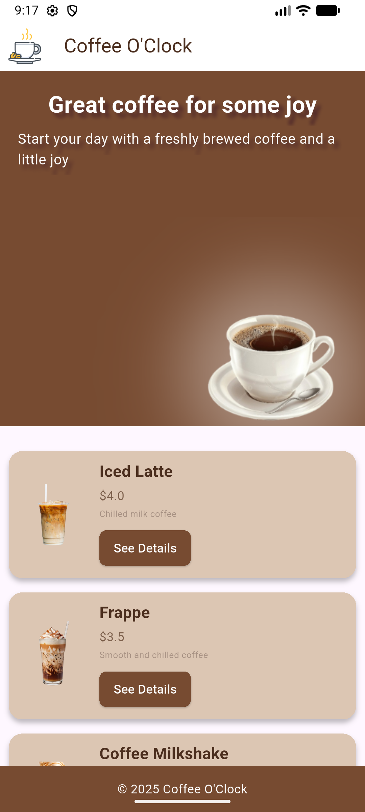
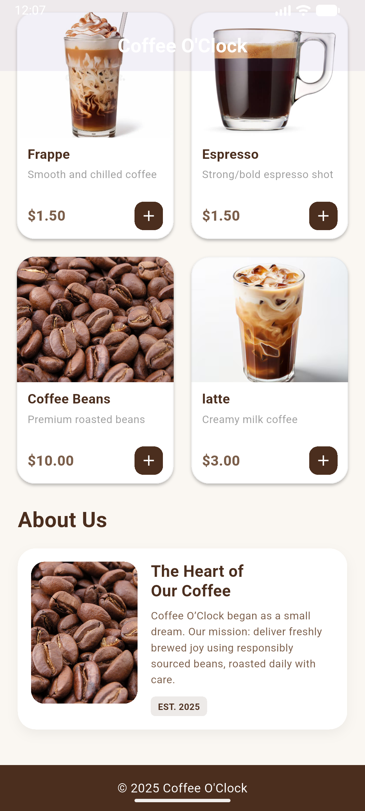
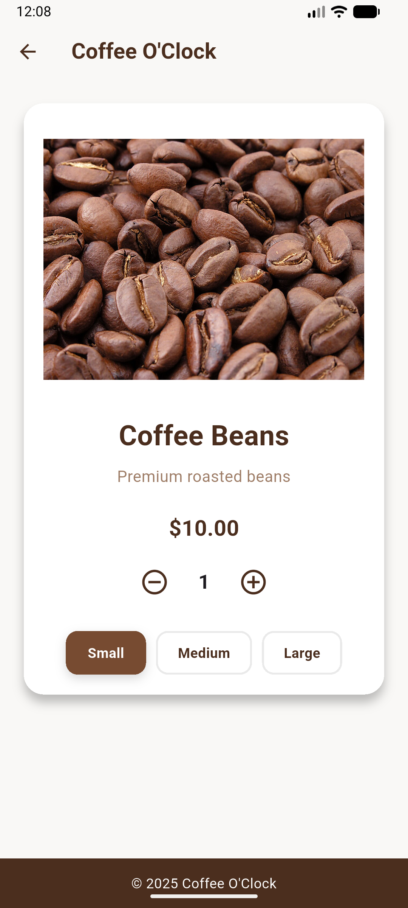
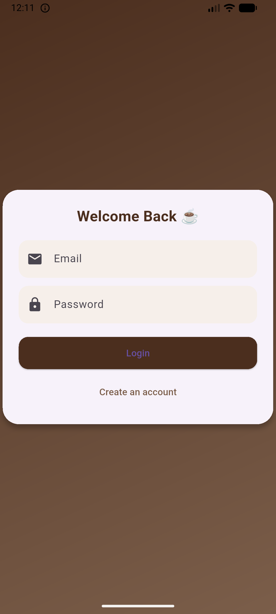
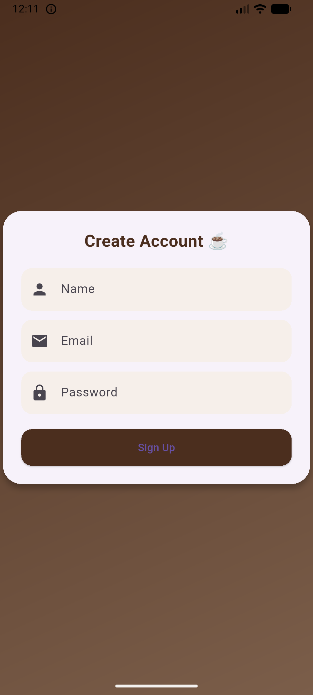

☕ **Coffee O'Clock** 
A sleek, responsive coffee shop application built with Flutter. This project focuses on a high-end "dark mode" aesthetic, utilizing reusable components and efficient state management for a premium shopping experience.

🚀 **Features**
Dynamic Product Catalog: A modular grid system displaying various coffee blends with detailed descriptions.
Login/Signup : Create an account and login.

## 📱 App Screenshots

| Home Page | Home Page | Details Page |
|---|---|---|
|  |  |  |

 
| Login  | Signup | 
|---|---|
|  |  |
